# Kisaantra - AI-Powered Agricultural Ecosystem

Kisaantra is a comprehensive agricultural ecosystem designed to empower Indian farmers with cutting-edge AI solutions. Built with love and innovation, this platform brings together various tools and technologies to make farming smarter and more efficient.

[Visit AgriSetu](https://agrisetu-1.onrender.com)

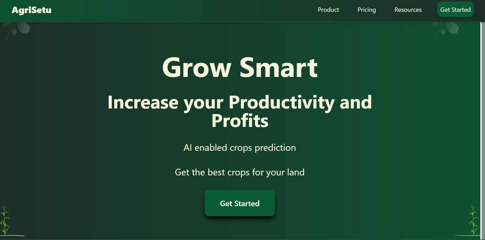

## 🌟 Features


### 1. AI Chatbot Assistant
- 24/7 farming assistance
- Crop-specific guidance
- Weather updates and alerts

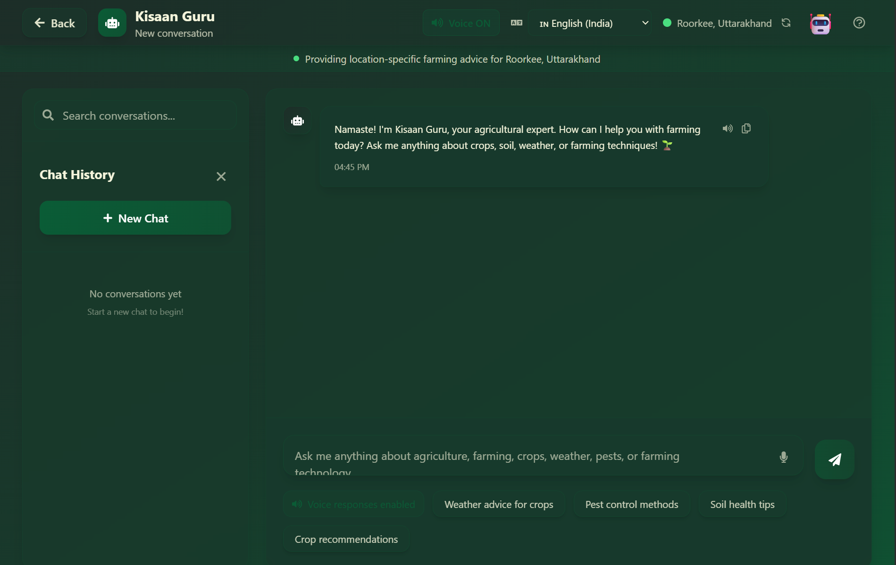

### 2. Crop Management
- Advanced crop recommendation system
- Disease detection using AI
- Real-time crop analysis

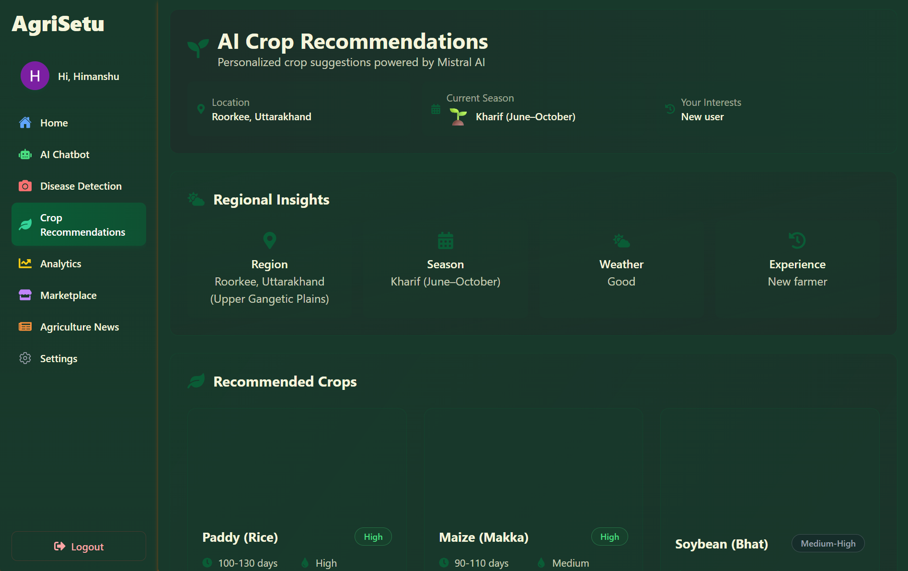
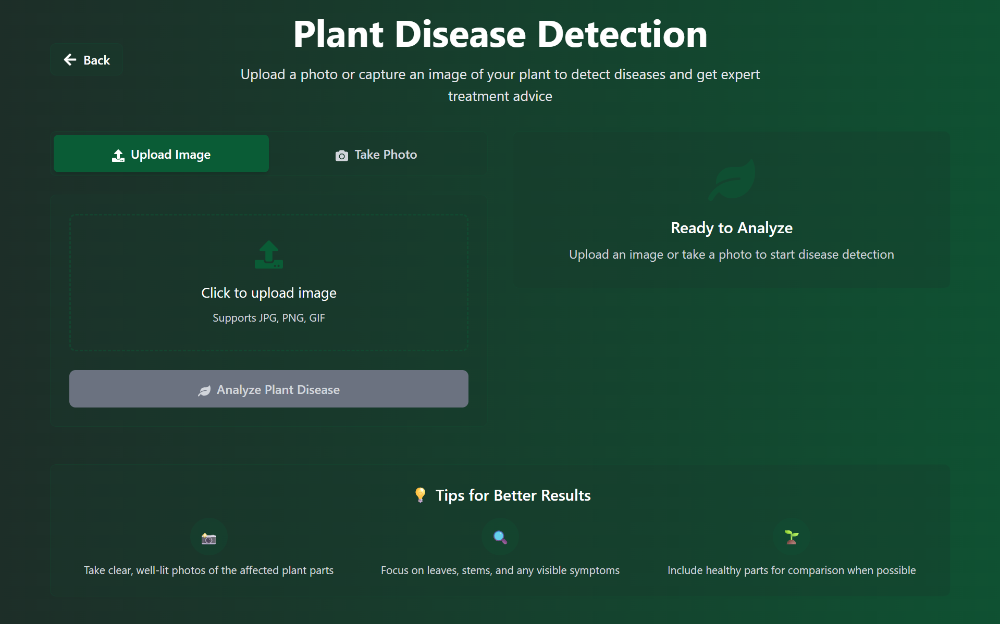

### 3. Market Analysis
- Real-time market trends
- Price prediction
- Supply chain insights

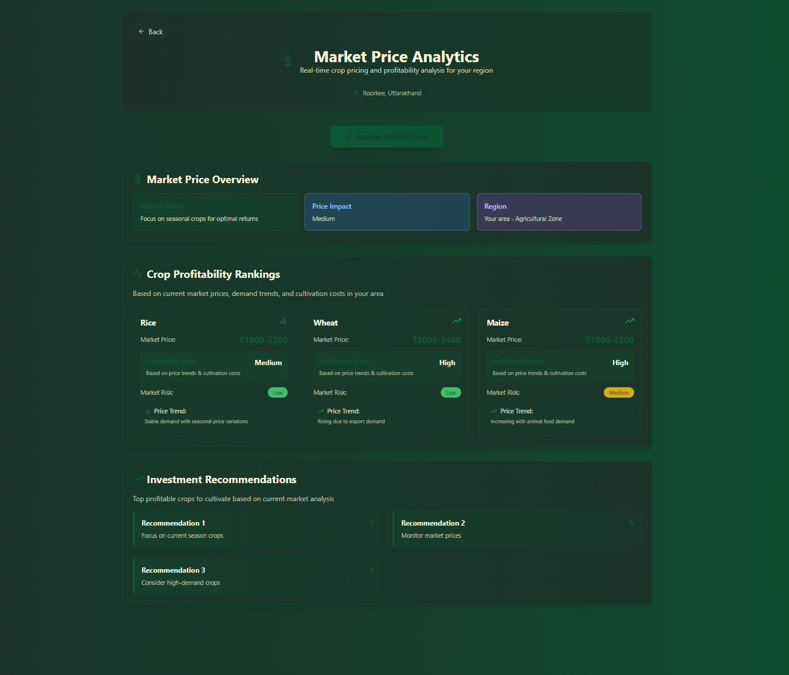

### 4. Multilingual News Feed
- Agricultural news in English
- Hindi language support
- Real-time updates

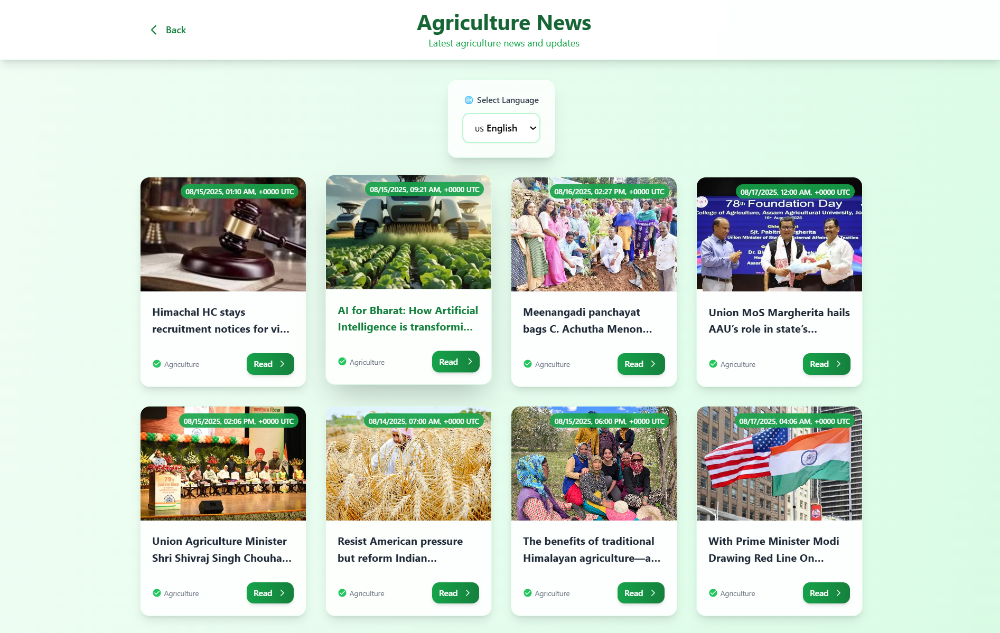
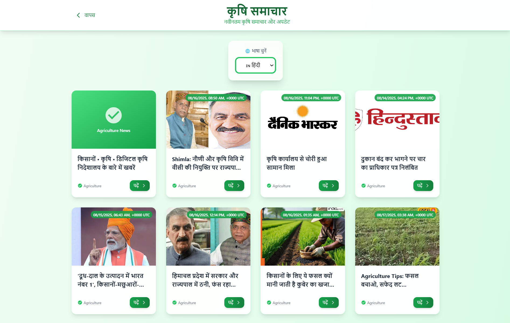

### 5. AI-Powered Marketplace
- Voice-enabled shopping experience
- Real-time voice recognition and search
- Intelligent cart management with voice commands
- Interactive AI assistant for product recommendations

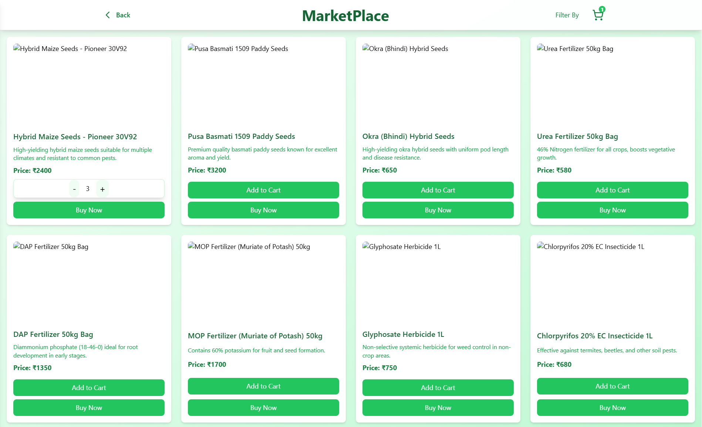

## � Project Structure

```
kisaantra/
├── README.md
├── backend/
│   ├── package.json
│   ├── public/
│   │   └── temp/
│   └── src/
│       ├── app.js
│       ├── constants.js
│       ├── index.js
│       ├── nodemon.json
│       ├── controllers/
│       │   ├── aiCartController.js
│       │   ├── analyticsController.js
│       │   ├── chatController.js
│       │   ├── chatmodelController.js
│       │   ├── cropRecommendationController.js
│       │   ├── imageController.js
│       │   ├── marketController.js
│       │   ├── newsController.js
│       │   ├── translationController.js
│       │   ├── userController.js
│       │   ├── weatherController.js
│       │   └── whisperController.js
│       ├── db/
│       │   └── db.js
│       ├── middleware/
│       │   ├── auth.middleware.js
│       │   └── multer.js
│       ├── models/
│           ├── chat.model.js
│           ├── market.model.js
│           └── user.model.js
│      
├── frontend/
│   ├── package.json
│   ├── README.md
│   ├── tailwind.config.js
│   ├── public/
│   │   ├── favicon.ico
│   │   ├── index.html
│   │   ├── logo192.png
│   │   ├── logo512.png
│   │   ├── manifest.json
│   │   └── robots.txt
│   └── src/
│       ├── App.js
│       ├── index.css
│       ├── index.js
│       ├── Components/
│       │   ├── API-animation.js
│       │   ├── Footer.js
│       │   ├── LoadingAnimation.js
│       │   ├── Navbar.js
│       │   └── Sidebar.js
│       ├── images/
│       │   ├── ChatBot.png
│       │   ├── CheckoutPage.png
│       │   ├── CropRecommendation.png
│       │   ├── DiseaseDetection.png
│       │   ├── HomePage.png
│       │   ├── LandingPage.png
│       │   ├── LoginPage.png
│       │   ├── MarketAnalysis.png
│       │   ├── MarketPlace.png
│       │   ├── NewsEnglish.png
│       │   ├── NewsHindi.png
│       │   └── RegisterPage.png
│       └── pages/
│           ├── AgriNews.js
│           ├── AIChatbot.js
│           ├── Analytics.js
│           ├── Checkout.js
│           ├── CropRecommendation.js
│           ├── DiseaseDetection.js
│           ├── Home.js
│           ├── LandingPage.js
│           ├── LoginPage.js
│           ├── Market.js
│           ├── RegisterPage.js
│           └── Settings.js
└── ml_model/
    ├── requirements.txt
    └── server.py
```

## �🛠️ Tech Stack

### Frontend
- React.js
- Tailwind CSS
- WebSpeech API
- React Router
- React Hot Toast

### Backend
- Node.js
- Express.js
- MongoDB
- JWT Authentication
- Multer for file handling

### AI/ML
- LangChain
- Mistral AI
- PyTorch for crop disease detection
- Machine Learning models for crop recommendations

### Cloud & Deployment
- MongoDB Atlas
- Render for hosting
- Cloudinary for image management

## 🚀 Installation & Setup

### Prerequisites
- Node.js (v16 or higher)
- Python 3.8+ (for ML models)
- MongoDB

### Frontend Setup
```bash
cd frontend
npm install
npm start
```

### Backend Setup
```bash
cd backend
npm install
npm run dev
```

### ML Model Setup
```bash
cd ml_model
pip install -r requirements.txt
python server.py
```

### Environment Variables
Create .env files in both frontend and backend directories:

Frontend (.env):
```
REACT_APP_BACKEND_URI=http://localhost:8000
```

Backend (.env):
```
MONGODB_URI=your_mongodb_uri
JWT_SECRET=your_jwt_secret
MISTRAL_API_KEY=your_mistral_api_key
```

## 🌐 Live Demo
[Visit AgriSetu](https://agrisetu-1.onrender.com)

## 📱 User Interface

### Authentication
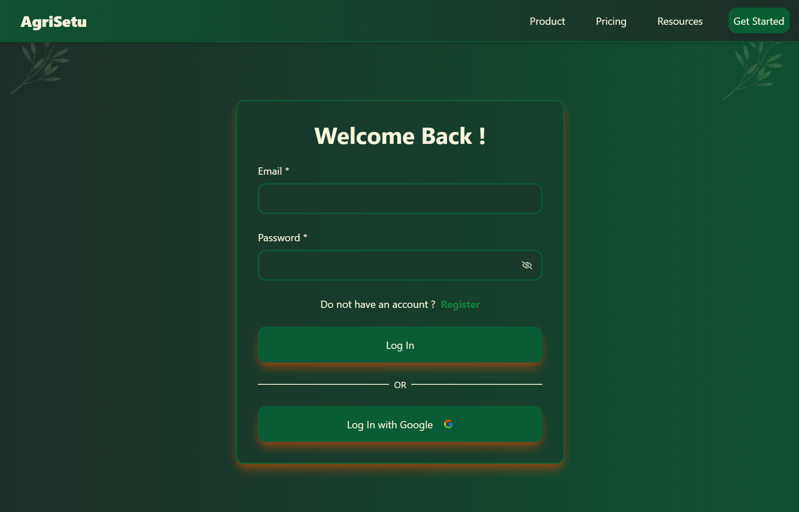
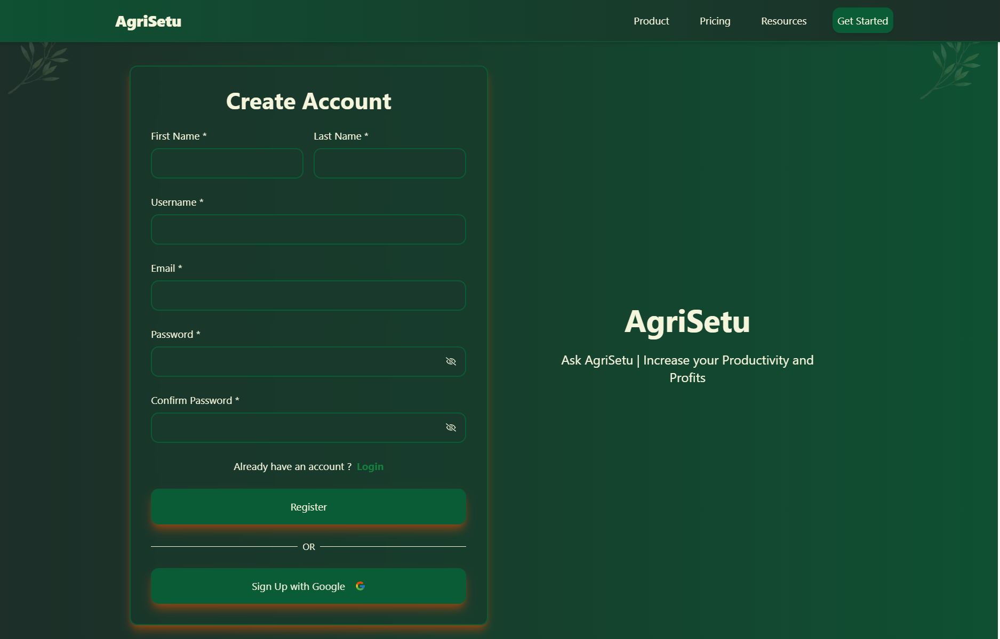

### Main Application
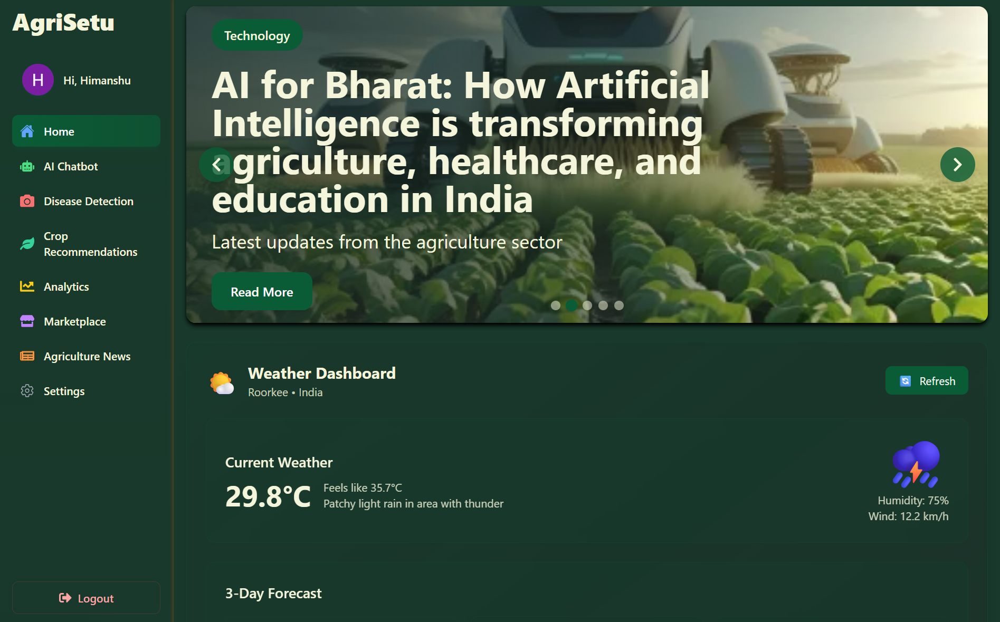
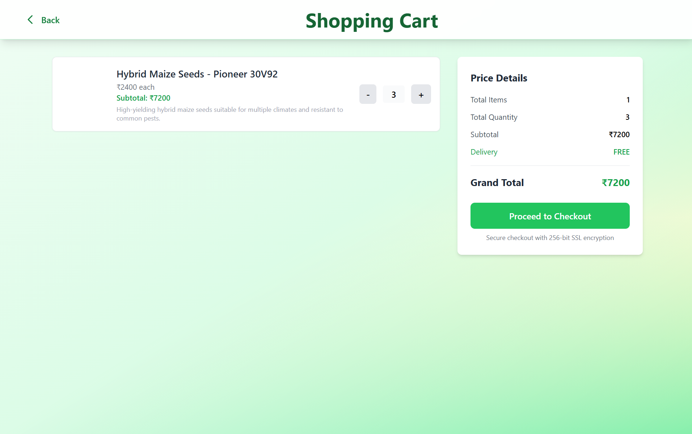

## 🤝 Contributing
We welcome contributions! Please feel free to submit a Pull Request.

## 📝 License
This project is licensed under the MIT License - see the LICENSE file for details.

## 👥 Team
- The 404s- 
- Himanshu Sharma
- Hemant Bhakar

---
Made with ❤️ for Indian Farmers 🌾
